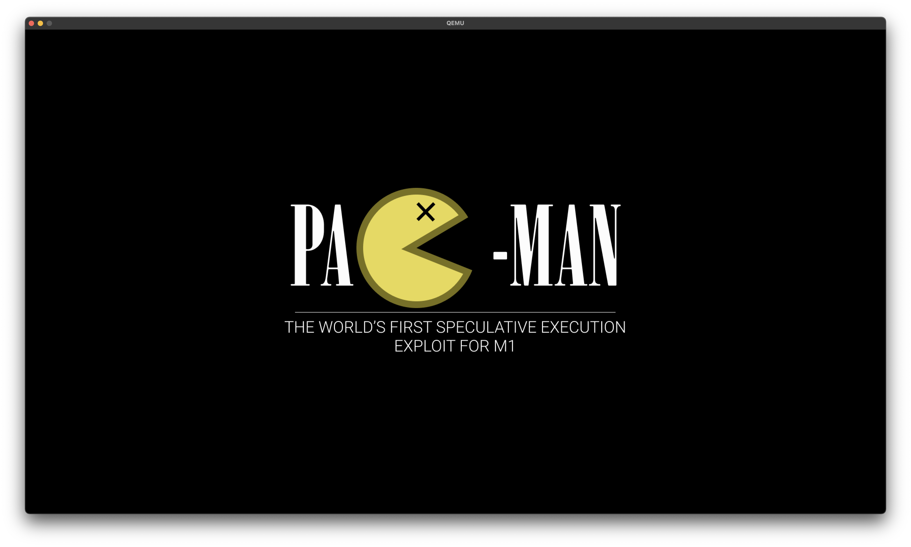

# PacmanOS
An aarch64 operating system / hypervisor targetting the M1 chip, designed for microarchitecture research and also for fun

## Building

You'll need rust nightly and the `aarch64-unknown-linux-gnu` target

First install Rust and then run the following:

```
rustup update nightly
rustup override add nightly
cargo install xargo
rustup component add rust-src
rustup target add aarch64-unknown-linux-gnu
```

Then you should be able to build the rust component of PacmanOS with `build.sh`

Don't forget to link every time you change the Rust!

### Cross Compiling

The Apple M1 PacmanOS target is defined in `applem1-pacmanos-none.json`. It is based on the `aarch64-unknown-linux-gnu` target for Rust. You can get the default builtin target json with the following command:

```
rustc +nightly -Z unstable-options --print target-spec-json --target aarch64-unknown-linux-gnu
```

See https://docs.rust-embedded.org/embedonomicon/custom-target.html

## Linking

You can link the built Rust binary with the `linker.ld` linker script using the provided container and Makefile:

Link:

`docker-compose run devel make`

Cleanup:

`docker-compose run devel make clean`

If you're on Linux and have `aarch64-linux-gnu-ld` then you can just run `make` from the command line to link

## Virtualization

You can simulate PacmanOS in qemu using our qemu mod.



### Guide

First, clone qemu. I'm on `682aa69b1f4dd5f2905a94066fa4c853adc33251`. Then apply `qemu.patch` inside the qemu directory:

```
git apply qemu.patch
```

Next, run the following to build qemu (again, from inside the qemu directory):

```
mkdir build
cd build
../configure --target-list=aarch64-softmmu
make -j8
```

If you're on an M1 Mac, you'll need to probably fix a few system headers. (At least I did). As of Monterey 12.0.1 and XCode 13.1, I had to do the following:
```
Patch /Applications/Xcode.app/Contents/Developer/Platforms/MacOSX.platform/Developer/SDKs/MacOSX.sdk/usr/include/mach/task.h:

// @PACMAN
// Joseph added this (lines 16-18)
typedef uint32_t task_corpse_forking_behavior_t;
```

and

```
Patch /Applications/Xcode.app/Contents/Developer/Platforms/MacOSX.platform/Developer/SDKs/MacOSX12.0.sdk/usr/include/mach/port.h:

// @PACMAN
// Joseph added this (lines 327 to 342)
/*
 * Structure used to pass information about the service port
 */
#define MACH_SERVICE_PORT_INFO_STRING_NAME_MAX_BUF_LEN  255    /* Maximum length of the port string name buffer */

typedef struct mach_service_port_info {
    char                    mspi_string_name[MACH_SERVICE_PORT_INFO_STRING_NAME_MAX_BUF_LEN]; /* Service port's string name */
    uint8_t                 mspi_domain_type;          /* Service port domain */
} mach_service_port_info_data_t;

#define MACH_SERVICE_PORT_INFO_COUNT ((char) \
    (sizeof(mach_service_port_info_data_t)/sizeof(char)))

typedef struct mach_service_port_info * mach_service_port_info_t;
```

## Idiosyncrasies

The current Qemu patch does not add emulated iBoot support (yet). For now, the kernel needs to
detect whether it is running in Qemu or on bare metal, and adjust its framebuffer (and eventually serial) address mappings accordingly (rather
than reading the iBoot args).

Additionally, Qemu makes the flash devices (starting from `0x0000000000000000`, which is where our ELF is dumped) read only. So instead
of using the `__DATA` section for the stack, we need to use somewhere in Qemu guest physical RAM for the stack. *This will be a problem
for future builds where the `__DATA` section is used for more stuff!*

The Qemu framebuffer uses the ramfb device with the following configuration (setup for you so PacmanOS doesn't need to bother with fw_cfg):

```
1920 by 1080
32bpp
ARGB8888
Framebuffer: 0x0000000080000000
```

# Credits

The linker script and infrastructure come from the [m1n1 project](https://github.com/AsahiLinux/m1n1)

Thanks the Asahi Linux team for their wonderful detailed reverse engineering of the M1 boot process!
